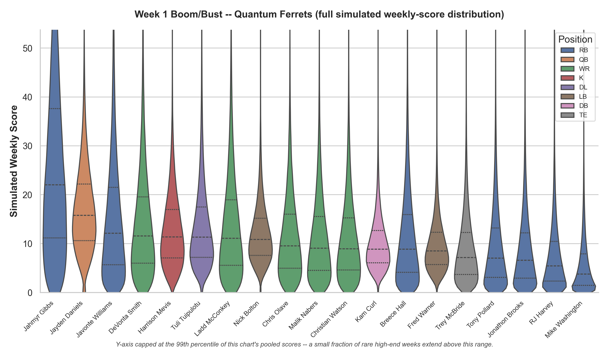

# Fantasy Football Monte Carlo Simulation

[](https://github.com/Brandon-Kimberly/2026-fantasy-football-simulation/actions/workflows/ci.yml)

[](LICENSE)

[](#validation-and-audit-trail)

## In plain terms

Fantasy sites give each player one projected number. This project gives each player a
range of likely scores instead, built from data on how much that player's results really
swing from week to week. It then plays out the rest of the season 10,000 times, with
different luck each time. Questions like "will I make the playoffs?" are answered by
counting: a team that makes it in 6,800 of the 10,000 simulated seasons has a 68%
chance. Every probability in the reports is a count of that kind, and the model is
checked against what actually happened in this league last year.

**What this is:** a Monte Carlo season simulator and seven decision tools for a real
IDP fantasy league. Each run simulates 10,000 seasons forward from the current week.
Every projection is a distribution. Every probability carries a standard error.

**What makes it different:** the audit trail. **~75 findings and tracked follow-ups
across 8 audit phases: 46 fixed or built, six suspected defects measured-and-cleared, 5
fixes reverted on real-data evidence. The full ledger is [AUDIT_SUMMARY.md](AUDIT_SUMMARY.md).**
Every fix required a test that failed first. Every constant cites a source or says
"unverified". A byte-exact 15-test golden master and a per-commit real-data backtest
gate decide what ships. When a measurement cleared a suspected defect, the claim was
retired instead of "fixed" (F13, F14, F16, F20, F23, F24).

**Pre-registered:** the season's success criteria -- calibration, points-for, and the
coverage gap -- were committed and sha256-locked **before any game was played**, with
record and playoff results explicitly scored as neither success nor failure:
[SEASON_2026_EVALUATION.md](SEASON_2026_EVALUATION.md). A tamper guard hashes the file
on every test run.

**How it was built:** with Claude Code. The audit methodology, the accept/reject decision
on every finding, and the domain judgment are mine. The code is largely AI-generated.
The experiment is whether disciplined verification can make AI-generated code
trustworthy. The audit trail above is the evidence either way.


*From the sanitized sample report (fictional team names, real NFL players). Each violin
is one starter's simulated week: the upside, the bust tail, and the quartiles in one
look. Seeing the whole distribution is the point of simulating instead of projecting.*

**Identity note:** manager and team identities in this repository are pseudonymized
(F37): fictional team names, roster-id keys, league IDs in environment variables only.
Every number is real — projections, transactions, results — and the pseudonymization is
itself test-pinned (a leak check gates the published sample; goldens and a behavioral
baseline proved the rename changed nothing).

**[View a full sanitized sample report](https://brandon-kimberly.github.io/2026-fantasy-football-simulation/sample/weekly_report_sample.html)**.
Team names are fictional; players and projections are real. `scripts.make_sample_report`
builds it from live data on every renderer change (a Pages workflow -- the sample is a
build product, never committed) and refuses to publish unless a leak check for every
real team name, username and league ID comes back clean.

## Weekly use: one command

```bash
py -3.10 -m scripts.weekly_report            # sync -> simulate -> charts -> grades -> lineup -> matchup -> waivers
py -3.10 -m scripts.weekly_report --full     # ... plus the trade-target finder (--evaluate N runs tool 2 on the top N)
py -3.10 -m scripts.weekly_report --embed    # inline the charts (portable single HTML, ~15-20 MB)
py -3.10 -m scripts.check_freshness          # one glance: has sync run this week, and did it succeed?
```

With no arguments it uses `config.MY_TEAM` and the synced week. The orchestrator chains
every step in-process and writes one consolidated digest, as sortable-table HTML plus
Markdown, to `data/decisions/week_NN/` (`--canonical`) or `week_NN/archive/` (default).
`--embed` inlines every chart. That file is several MB, and the `_embed` suffix warns
you before opening.

**It fails loud.** Any step that raises, or leaves no data behind, stops the chain,
writes the digest with a `FAILED AT STEP ...` banner and no downstream sections, and
exits 1. Nothing runs on stale or partial data. A sync that tolerated failures leads
the digest with its `DEGRADED` list every week it persists. These gates exist because
an earlier defect silently truncated real data on every suite run and was found only by
accident (`docs/AUDIT_PLAN.md` F11).

## Decision tools

Each is a script under `scripts/` and a function in `fantasy_sim.decisions`. They read
`data/current/` only, write their JSON records to `data/decisions/`, and never touch the
season exports. The engine is not modified. The one extraction made for them
(`_weekly_score_from_z`) is pinned byte-identical by the golden master.

| Question | Tool |
|---|---|
| Start A or B this week? P(A > B) computed from the players' *joint* simulated distributions. | `py -3.10 -m scripts.compare_players "Player A" "Player B" [--light]` |
| What lineup does the engine's own rule set, and by how much? Each starter's p10/p50/p90 and the margin over the best bench alternative. | `py -3.10 -m scripts.optimize_lineup` |
| Against *this week's opponent*, play safe or swing for variance? Four lineup constructions on one joint sample, each with P(beat opponent) and P(beat median). | `py -3.10 -m scripts.matchup_lineup [--no-cross]` |
| Who should I claim, and what should I bid? Roster gaps against the free-agent pool, ranked by value over replacement, with P(beats my incumbent). | `py -3.10 -m scripts.waiver_targets [--positions RB,WR]` |
| Is this specific trade good for me? Two paired full simulations on the same seeds, and the Champ%/Playoff% delta for both sides and every bystander. | `py -3.10 -m scripts.evaluate_trade --team-a ... --a-gives ... --team-b ... --b-gives ...` |
| Who should I be trading for, and who wants what I have? Buried bench players who would start for me, and my surplus that has a buyer. | `py -3.10 -m scripts.find_trades [--evaluate N]` |
| How good is each roster, really? Tier and VORP per position and overall, and a league table by lineup VORP. | `py -3.10 -m scripts.roster_grades [--team ...]` |

## Or run the pieces individually

```bash
py -3.10 -m scripts.run_sync                    # pull live data into data/current/ and write the sync manifest
py -3.10 -m scripts.run_simulation              # the Monte Carlo engine: exports + charts + boom/bust + floor/ceiling
py -3.10 -m scripts.run_positional_tiers        # statistically-derived tiers per position (PNG + sortable HTML tables)
py -3.10 -m scripts.run_strength_of_schedule    # NFL-team and fantasy-roster schedule heatmaps
py -3.10 -m scripts.run_win_trajectory          # expected wins over the simulated season, all teams
py -3.10 -m scripts.run_windows                 # this week's three canonical-run windows: open, covered, or missed (read-only)
py -3.10 -m scripts.windows_watch               # Actions window watcher: JSON verdict from the committed predictions log
py -3.10 -m scripts.canonical_gate              # F36: may an unattended run quote canonical predictions? (+ remediation compose)
py -3.10 -m scripts.draft_review                # at-draft value review of an ingested draft (--season; PROXY caveat on the page)
py -3.10 -m scripts.evaluate_move               # paired evaluation of an add/drop or waiver (--log-tx, --evaluate-unevaluated)
py -3.10 -m scripts.season_retrospective        # a completed season in four measurements, no combined verdict
py -3.10 -m scripts.run_season_backtest         # win-total / playoff backtest vs the real 2025 season
py -3.10 -m scripts.run_points_backtest         # points-level backtest (bias, mean z, coverage), logged with commit + interpreter
py -3.10 -m scripts.run_player_backtest         # variance / correlation / epistemic constants vs real player-week data
py -3.10 -m scripts.free_add_study              # F34: committed 2025 churn derivation (adds/timing/retention/drops/occupancy)
py -3.10 -m scripts.migrate_identity            # F37: the one-time identity migration (mechanics; the map stays untracked)
py -3.10 -m scripts.run_behavior_check          # simulated mechanic rates vs the real 2025 league + drift vs the committed baseline
```

## How the model works

The consolidated statistical specification -- distributions, estimation procedures,
calibration results, and known limitations in one document -- is
[docs/METHODS.md](docs/METHODS.md). The short version:

- **Data pipeline** (`fantasy_sim.sync`): real Sleeper projections blended with an
  independent ESPN source, real Vegas totals and spreads, defensive strength derived from
  completed games with empirical-Bayes shrinkage, and live byes and availability. Every
  sync appends to the unrefetchable `data/logs/projection_log.jsonl` and writes the
  manifest *last*, so a manifest's presence means the sync completed.
- **Two-variance scores:** each player's week is lognormal. Aleatoric (week-to-week)
  variance is redrawn every week. Epistemic (projection) variance is drawn once per
  simulated season and held, which carries parameter uncertainty through to season
  outcomes rather than letting it average away.
- **Correlation:** same-NFL-team players move together through a Gaussian copula with
  measured coefficients.
- **Lineups on expectation, never on outcomes:** chosen by the Hungarian algorithm on
  pre-game expectation. Realised scores never influence selection. That would be
  lookahead leakage.
- **Injuries:** an onset hazard and a two-component duration mixture; vacated volume is
  conserved. A rostered player with no projection but an absence status (IR / PUP /
  Commissioner Exempt) is carried at his last data-sourced mean and returns on a measured
  hazard, never at a hand-typed healthy baseline.
- **Season mechanics:** waivers and FAAB bidding run stochastically through the season,
  calibrated to the real league's spending. An automatic trade mechanism runs but almost
  never completes a trade. That is a tracked limitation. The 4-team playoff is simulated,
  or seeded from banked standings when the run starts inside it.
- **Backtesting** (`fantasy_sim.backtest_season`, `backtest_player`,
  `scripts.run_points_backtest`): as-of-week inputs reconstructed from this league's real
  2025 season and run through the *actual, unmodified* engine. The player-level backtest
  checks the constants directly against real player-week data. Each states its own
  limitations in its docstring.

`config.py` holds every constant with its derivation or an explicit "unverified";
`storage.py` names every path the project reads or writes, once. `data/` has four buckets:
`current/` (the last sync's snapshot), `weeks/` (per-week exports and charts),
`decisions/` (tool records and digests), and `logs/` (append-only, git-tracked).

## Setup

Runtime is **Python 3.10** with the pins in `requirements.txt` (exact for the
numeric stack the goldens are byte-locked to; ranges for plumbing like `requests`):

```bash
py -3.10 -m pip install -r requirements.txt
git config core.hooksPath hooks    # one-time: the docs guards run at pre-commit (~2s)
```

Optional: schedule `hooks/windows_check.ps1` daily (Task Scheduler, hidden). It logs
the canonical-window report to `data/windows_check.log` and pops a message box only
when a window needs action. Canonical runs commit and push `data/logs/` themselves;
`scripts.check_freshness` prints an ACTION line whenever log data is unpushed.

(Plain `python` resolves to a broken end-of-life 3.8 on the original machine; use
`py -3.10`. See `docs/AUDIT_PLAN.md` R1.)

Two credentials are read from environment variables, never hardcoded:

| Variable | Required for |
|---|---|
| `ODDS_API_KEY` | **Required for any correct in-season forecast.** Before the 2026-09-09 gate the engine runs on a hand-verified week-1 table; after it, this key is the only source of real lines. Without it every team gets a flat 21.5 total and no opponent. The sync manifest, `check_freshness` and the digest's DEGRADED block all say so loudly, but the forecast is matchup-blind. Free tier at the-odds-api.com. |
| `ESPN_S2`, `ESPN_SWID` | Only if the dedicated ESPN league is private. Without ESPN the blend and its disagreement-driven epistemic term simply do not apply. |

## Testing

```bash
py -3.10 -m unittest discover tests      # expected: Ran 587 tests ... OK (skipped=1, expected failures=3)
py -3.10 -m coverage run -m unittest discover tests && py -3.10 -m coverage report --show-missing
                                         # branch coverage; the committed floor (coverage_floor.txt) gates the
                                         # fantasy_sim package. Standalone milestone scripts are measured but
                                         # not gated, since they are suite-external by design.
                                         # CAVEAT: high coverage on the two monoliths means the golden master RUNS them,
                                         # not that their behavior is asserted line-by-line.
py -3.10 -m tests.test_golden_master     # the reproducibility harness: 15 tests, three scenarios, byte-exact hashes
```

**Platform note:** the golden master is byte-locked to the Windows platform that
generated it (the documented lock in `tests/golden_master.py`; CI runs `windows-latest`
for the same reason). On Linux or macOS, expect exactly those 15 golden tests to fail on
float-representation differences while the rest of the suite passes -- that is the
platform lock working, not a broken build.

The skip is the live-ingestion test (`RUN_LIVE_INGESTION_TESTS=1` runs it); the three
expected failures are deliberate red characterisations of tracked open items. Any engine
change either leaves the golden hashes byte-identical or regenerates them with the deltas
explained in the commit.

## Validation and audit trail

**The 2026 season's success criteria were committed before any game was played.**
Calibration, points-for, and the coverage gap, with record/playoffs scored as neither
success nor failure: [SEASON_2026_EVALUATION.md](SEASON_2026_EVALUATION.md).

This is the part of the project to read first if you want to know whether the numbers can be
trusted. The model was audited phase by phase, organised by property class (conservation,
orientation, invariance, bounds, liveness), and every finding, fix and deliberate non-fix
is recorded:

- **`AUDIT_SUMMARY.md`**: the whole arc on one page. Phases 0-7, what was found, fixed, and left
  open, with the numbers.
- **`docs/audit/AUDIT_PHASE_0_FINDINGS.md` … `docs/audit/AUDIT_PHASE_7_FINDINGS.md`**: seven phase reports
  (reproducibility harness; conservation and invariants; the statistical core; data ingestion
  integrity; decision logic; season and playoff mechanics + outputs; calibration).
- **`docs/AUDIT_PLAN.md`**: the working spec, with 37 tracked follow-ups (F1-F37), each with
  Origin / Scope / Acceptance criterion / When, and its outcome when closed, and the R1
  machine-fault investigation.

Beyond the summary line above: a **real-data backtest gate** on this league's 2025 season
(points bias, mean z, coverage, logged per commit and interpreter) that every
correlation- or scoring-adjacent change must pass; constants measured on real player-week
data (copula correlations re-confirmed league-wide on 391 players / 714 pooled
pair-weeks); and disagreements with an external audit settled by measurement (tail
dependence measured and deliberately not adopted; the 80-point cap re-measured on
playoff equity and kept).

## Adapting this to your own league

**The single most important thing first: the constants were measured in *this* league's scoring
system and need re-deriving for yours.** `VOLATILITY_CONSTANTS`, `EPISTEMIC_ERROR_RATES`,
`SIM_CONFIG['CORRELATIONS']`, the injury onset/duration/return parameters and the replacement
levels were all calibrated on real player-week data scored *this way* (`backtest_player`, F13,
F4/F5) and validated against *this* league's 2025 history. Change the scoring or the roster
format and those numbers are no longer sourced for your league. Re-run
`scripts.run_player_backtest` on your own league's data and re-establish the backtest
gate before trusting the outputs. Editing the IDs below without doing that produces a
professional-looking forecast whose constants belong to someone else's league.

**Straightforward, config-only edits** (`fantasy_sim/config.py`):
- `LEAGUE_ID`, `MY_TEAM`, `TEAM_NAME_MAP` (Sleeper display names -> your team labels),
  `ESPN_LEAGUE_ID` + `ESPN_S2`/`ESPN_SWID` (optional second source), `ODDS_API_KEY`.
- `MANAGER_PROFILES` (measured as outcome-inert; neutral values are a fine start),
  `KNOWN_MISSING_ASSETS` and `DUAL_ELIGIBILITY` (league-specific players).

**Format assumptions baked into the code**, beyond the config:
- **8 teams.** The trade block ranks standings as `[0:2]` rich / `[4:8]` desperate; the
  median-beat decision, all-play and seeding assume the league size; `TEAM_NAME_MAP` and
  `MANAGER_PROFILES` are eight entries.
- **14-week regular season, 4-team playoff in weeks 15-16** (`REGULAR_SEASON_WEEKS`, `top4`,
  the bracket seeding and the week-17 refusal).
- **Roster structure.** `REQUIRED_STARTING_SLOTS` (13: QB, 2 RB, 2 WR, TE, 3 FLEX, K, DL, LB, DB)
  drives the Hungarian assignment, the streamer scan, replacement levels and VORP;
  `ACTIVE_ROSTER_LIMIT = 19` in the trade evaluator; `BASE_STREAMER_MEANS` per slot.
- **IDP.** DL/LB/DB slots with Sleeper's raw positions normalised (DE/DT/NT -> DL, CB/S/FS/SS ->
  DB). The IDP variance, epistemic and injury constants are *less rigorously sourced* than the
  offensive ones (documented in `config.py`), and the ESPN blend excludes K and IDP by design.
  A non-IDP league removes slots and loses nothing statistically. A new position needs new
  constants with sources.
- **Hybrid H2H + weekly-median scoring** (`SIM_CONFIG['MEDIAN_SCORING_ENABLED']`): two decisions
  per week, 28 max. The 2025 backtest runs with it *off* because that season was pure H2H.
  The flag exists so a season is simulated under the rules that applied to it.
- **2026-specific reference data:** `WEEK_1_VERIFIED_VEGAS` (a hand-verified preseason table
  that expires at the odds gate), `NFL_TEAMS`, and bye weeks derived from the live schedule.
